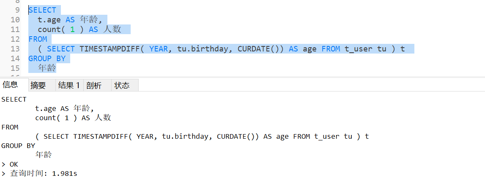
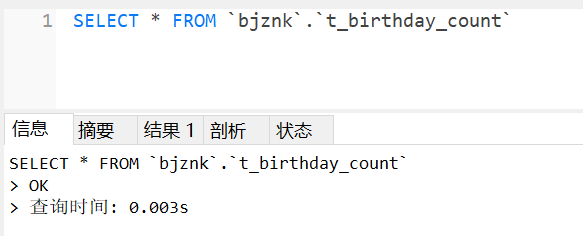

# SQL语句
```
SELECT
	t.age AS 年龄,
	count( 1 ) AS 人数 
FROM
	( SELECT TIMESTAMPDIFF( YEAR, tu.birthday, CURDATE()) AS age FROM t_user tu ) t 
GROUP BY
	年龄
```

可见纯sql是无法达到要求的。

# 分析与思路
* 1、用户的生日很大概率存在重复，去重可以减少参与计算的数据量。
* 2、题中并未提及时效性。
* 3、基础数据需要函数计算，可否考虑前置计算？

# 实现
* 1、在不考虑使用其他中间件缓存机制来实现的话，使用定时任务，保存sql查询结果为统计专用数据表，统计请求全部查询此表数据，统计数据的时效性取决于定时任务的执行频率。
``` 
CREATE TABLE t_birthday_count (
  `age` int DEFAULT NULL,
  `birthday` varchar(255) DEFAULT NULL,
  `count` bigint DEFAULT NULL,
  PRIMARY KEY (`id`)
) ENGINE=InnoDB;
```


* 2、后续处理增量数据只需要执行 
```
INSERT INTO 或 UPDATE 
 t_birthday_count 
    SET `count` = ( SELECT count(1) FROM t_birthday_count 
    WHERE birthday = @birthday )
 WHERE birthday = @birthday 
```
* 3、也可以前置