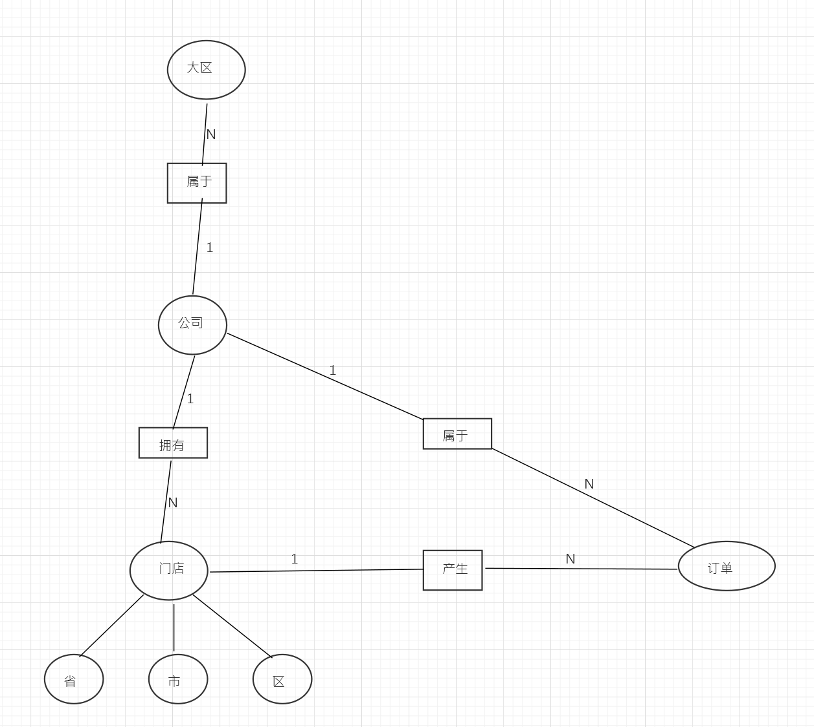
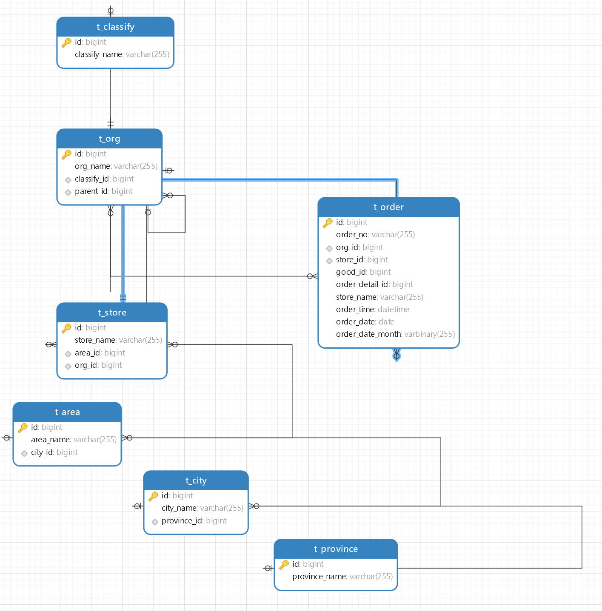

# 关系模式设计


* 总部大区可以多个，但每个公司只能属于一个大区，大区与公司的关系为 N：1
* 一个公司可以拥有多个门店，但门店只属于一个公司，公司和门店的关系为 1：N
* 一个门店可以产生多个订单，但订单只属于一个门店，订单与门店的关系为 N：1
* 门店拥有省、市、区的基本地区属性

# 1、主要表结构


```
SET NAMES utf8mb4;
-- ----------------------------
-- 订单表
-- ----------------------------
DROP TABLE IF EXISTS `t_order`;
CREATE TABLE `t_order`  (
  `id` bigint NOT NULL,
  `order_no` varchar(255) CHARACTERNOT NULL COMMENT '订单号',
  `org_id` bigint NOT NULL COMMENT '所属公司id',
  `store_id` bigint NOT NULL COMMENT '所属门店id',
  `good_id` bigint NOT NULL COMMENT '商品id',
  `order_detail_id` bigint NOT NULL COMMENT '订单详情表，存放sku信息',
  `store_name` varchar(255) CHARACTERNULL DEFAULT NULL COMMENT '冗余店面方便查询',
  `order_time` datetime NOT NULL COMMENT '下单时间',
  `order_date` date NOT NULL COMMENT '下单日期',
  `order_date_month` varbinary(255) NULL DEFAULT NULL COMMENT '下单年月，冗余方便查询',
  `order_price` int NOT NULL COMMENT '订单金额，单位：分',
  `order_coupon_price` int DEFAULT NULL COMMENT '订单优惠金额，单位：分',
  `order_actual_price` int DEFAULT NULL COMMENT '实付金额，单位：分',
  PRIMARY KEY (`id`) USING BTREE,
  INDEX `fk_order_org_id`(`org_id` ASC) USING BTREE,
  INDEX `fk_order_store_id`(`store_id` ASC) USING BTREE,
  INDEX `idx_order_date_month`(`order_date_month` ASC) USING BTREE,
  CONSTRAINT `fk_order_org_id` FOREIGN KEY (`org_id`) REFERENCES `t_org` (`id`) ON DELETE RESTRICT ON UPDATE RESTRICT,
  CONSTRAINT `fk_order_store_id` FOREIGN KEY (`store_id`) REFERENCES `t_store` (`id`) ON DELETE RESTRICT ON UPDATE RESTRICT
) ENGINE = InnoDB;

-- ----------------------------
-- 公司表
-- ----------------------------
DROP TABLE IF EXISTS `t_org`;
CREATE TABLE `t_org`  (
  `id` bigint NOT NULL AUTO_INCREMENT,
  `org_name` varchar(255) CHARACTERNULL DEFAULT NULL COMMENT '公司名称',
  `classify_id` bigint NULL DEFAULT NULL,
  `parent_id` bigint NULL DEFAULT NULL COMMENT '父级公司Id',
  PRIMARY KEY (`id`) USING BTREE,
  INDEX `fk_parent_id`(`parent_id` ASC) USING BTREE,
  INDEX `fk_classify_id`(`classify_id` ASC) USING BTREE,
  CONSTRAINT `fk_parent_id` FOREIGN KEY (`parent_id`) REFERENCES `t_org` (`id`) ON DELETE RESTRICT ON UPDATE RESTRICT,
  CONSTRAINT `fk_classify_id` FOREIGN KEY (`classify_id`) REFERENCES `t_classify` (`id`) ON DELETE RESTRICT ON UPDATE RESTRICT
) ENGINE = InnoDB AUTO_INCREMENT = 1;

-- ----------------------------
-- 门店
-- ----------------------------
DROP TABLE IF EXISTS `t_store`;
CREATE TABLE `t_store`  (
  `id` bigint NOT NULL AUTO_INCREMENT,
  `store_name` varchar(255) CHARACTERNULL DEFAULT NULL COMMENT '门店名称',
  `area_id` bigint NULL DEFAULT NULL COMMENT '所在区id',
  `org_id` bigint NULL DEFAULT NULL COMMENT '所属公司',
  PRIMARY KEY (`id`) USING BTREE,
  INDEX `fk_area_id`(`area_id` ASC) USING BTREE,
  INDEX `fk_org_id`(`org_id` ASC) USING BTREE,
  CONSTRAINT `fk_store_area_id` FOREIGN KEY (`area_id`) REFERENCES `t_area` (`id`) ON DELETE RESTRICT ON UPDATE RESTRICT,
  CONSTRAINT `fk_store_org_id` FOREIGN KEY (`org_id`) REFERENCES `t_org` (`id`) ON DELETE RESTRICT ON UPDATE RESTRICT
) ENGINE = InnoDB;

```

#2、查询全公司所有的门店。
```
SELECT
	tse.`store_name` 门店名,
	CONCAT( tpe.`province_name`, '_', tcy.`city_name`, '_', taa.`area_name` ) 所在地,
	tog.`org_name` 所属公司 
FROM
	t_store tse
	JOIN t_org tog ON tog.id = tse.org_id
	JOIN t_area taa ON taa.id = tse.area_id
	JOIN t_city tcy ON tcy.id = taa.city_id
	JOIN t_province tpe ON tpe.id = tcy.province_id 
GROUP BY
	tse.id 
```
#3、查询石家庄市的所有的门店
```
SELECT
	* 
FROM
	t_store ts 
WHERE
	ts.area_id IN (
	SELECT
		taa.id 
	FROM
		t_area taa 
	WHERE
	taa.city_id = ( SELECT tcy.id FROM t_city tcy WHERE tcy.`city_name` = '石家庄市' ) 
	)
```
#4、查询全公司所有门店某个月的订单的收入总和。
```
SELECT
	ROUND( sum( tor.order_actual_price ), 2 ) total_money 
FROM
	t_order tor 
WHERE
	tor.order_date_month = '2022-03' 
	AND tor.store_id = 3
```

#5、查询北京分公司郊区所有门店的某个月的订单收入总和。
```
	
SELECT
	ROUND( sum( tor.order_actual_price ), 2 ) total_money 
FROM
	t_order tor 
WHERE
	tor.order_date_month = '2022-03' 
	AND tor.store_id IN (
	SELECT
		tse.id 
	FROM
		t_store tse 
	WHERE
	tse.org_id IN ( SELECT tog.id FROM t_org tog WHERE tog.parent_id = @北京分公司Id ) 
	)
```